# Wood Identification
Rand Richards

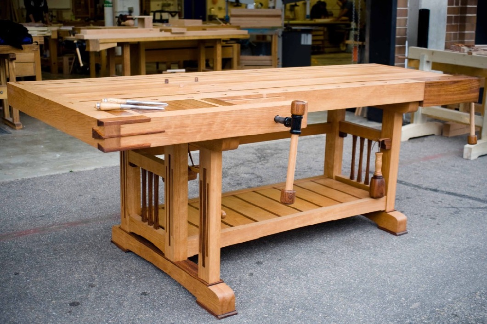

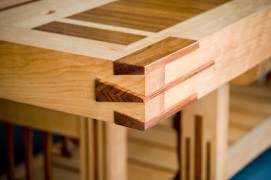

The project goal is to use machine learning to aid in the identification of wood types.  The end-goal is a program that will isolate the wood types to a max of three varieties, and provide tools (perhaps further machine learning algorithms) to narrow down the selection.  Identification begins with pictures of the end- grain of the lumber in question.
## Process of Sample Preparation

Wood was clean-cut and the planed or sanded to remove saw blade marks.

> 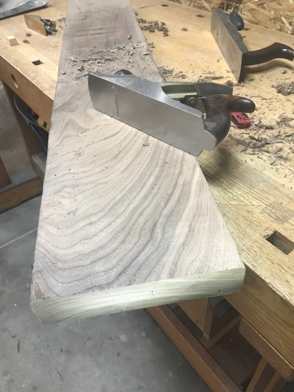
> 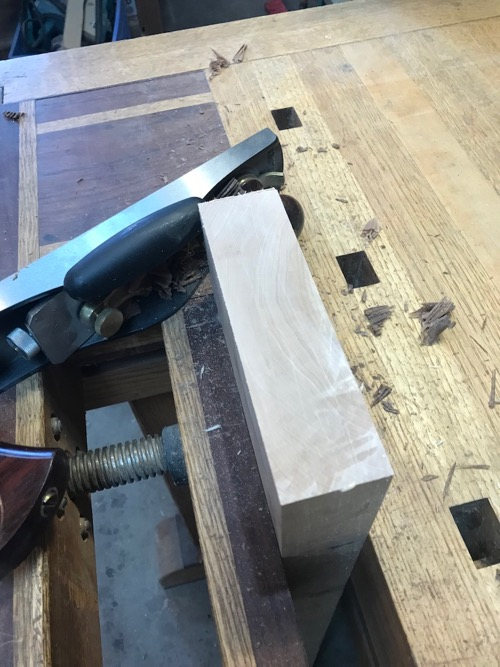  
Actual Image of Walnut used to train model  
> 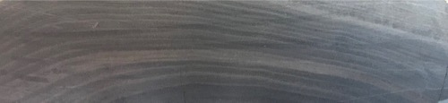  
Actual Image of Maple used to train model  
> 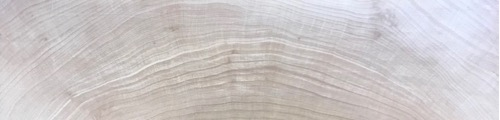  

### Test or Selection Group

I started with a relatively small test group of five hardwoods woods.  Hardwoods generally have more distinct early wood vs. late-wood rings

Pictures were taken with a variety of cameras, but to achieve consistent results with what user will take pictures with, an iPhone was used with picture taken from 8" away.

> Ash - Hardwood, ring-porous
> - Similar to White Oak  
> - Very different Early and Late woods rings
> - Nearly invisible medullary rays  

> - 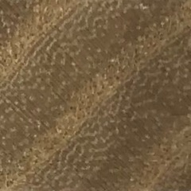   
>  

> Beech - Hardwood, diffuse-porous
> - My personal favorite woods
> - Tight grain configuration
> - Distinctive medullary rays  

> - 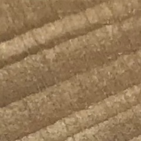

> Cherry - Hardwood, diffuse-porous  
> - Tighter grain structure
> - More difficult to identify from end-grain   

> - 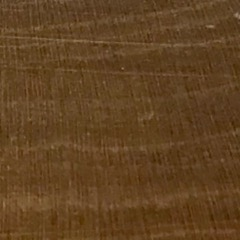

> Red Oak - Hardwood, ring-porous
> - Distinct Early and Late wood rings
> - Very open Early wood structure
> - pronounced medullary rays  

> - 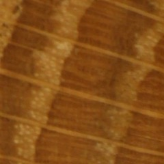

> White Oak
> - Similar to Red Oak, but early and late wood not as Distinct
> - Known for it's medullary rays, and thus often quarter-sawn  

> - 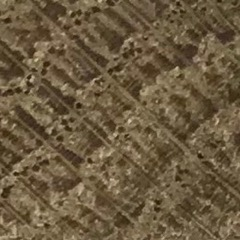  

# Image Processing  

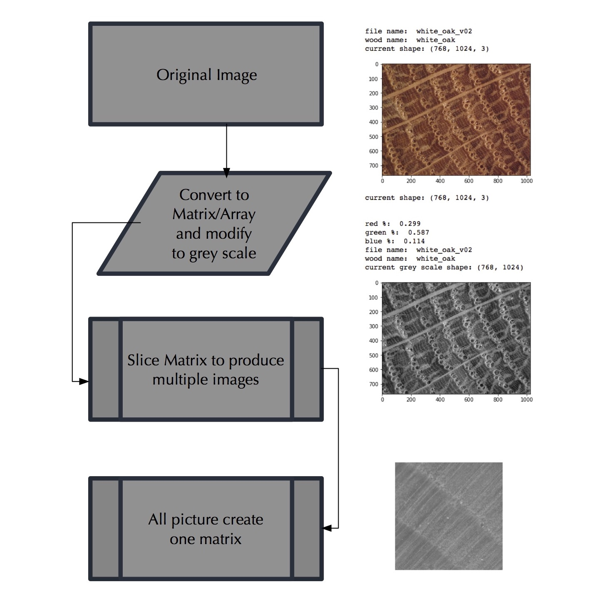

# Initial results:   Naive Bayes

I started with a simple model, Naive Bayes. The results were encouraging and gave me a proof of concept.

>- this is a rather simple machine learning model, but allowed at least a proof of concept that this would/should work.  Results were consistent with what you expect between the various wood species  
>- Model did great with the ring porous woods like the two oaks.  Was a little surprised it did such a good job distinguishing them.
>- The ash was a little mixed with the oaks, which also makes sense
>- the diffuse porous woods were/are a little harder to distinguish for both  computers and humans

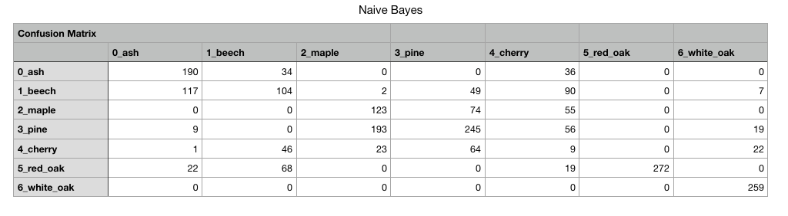  

# Convolutional Neural Network

 Initial Neural Network results are fair

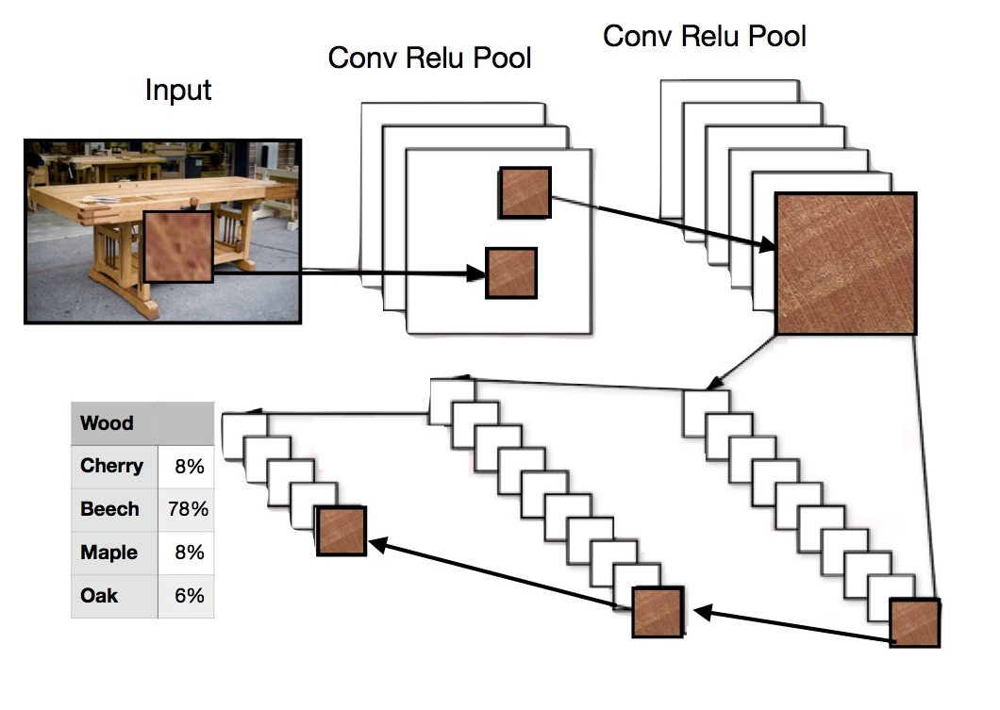

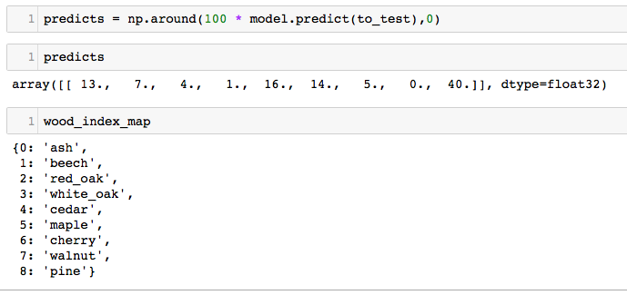  

## To Add :
>- deeper understanding of why for model
>- results for binary
>- Classification Reports
>- Index - with links at beginning of read me
>- draw.io
>- vdg16 cNN  
>- references

## Next:
>- currently retraining model on slightly larger slices - 180 x 180
>- have additional pictures of White Oak and Beech to add to database
>- first steps for implementation of iOS app has begun
