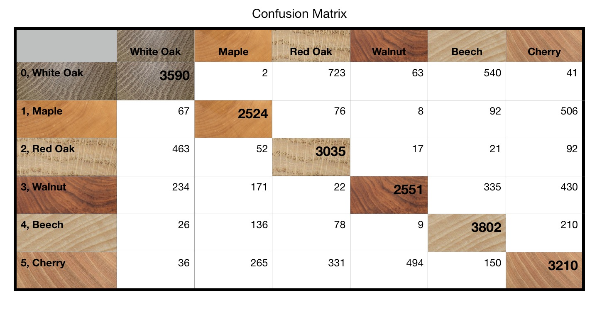

# Wood Identification
Rand Richards

The project goal is to use machine learning to aid in the identification of wood types.  The end-goal is a program that will isolate the wood types to a max of three varieties, and provide tools (perhaps further machine learning algorithms) to narrow down the selection.  Identification begins with pictures of the end- grain of the lumber in question.
## Outline
>- A) CODE  
>>- Python
>>>- [pipeline](src/pipeline.py)    
>>>- [coreML](src/coreML.py)  
>>- Jupyter Notebook
>>>- [Pipeline](src/Pipeline_Final.ipynb)
>>>- [Modeling](src/Modeling.ipynb)  
>- B) Process   
>- C) Explanation of data
>- D) Image Processing]
>- E) Data collected
>- F) Initial Results: Naive Bayes
>- G) Convolutional Neural Network
>- H) Actual Predictions
>- I) Next Steps
>- J) Future Projects

## Process of Sample Preparation

Wood was clean-cut and the planed or sanded to remove saw blade marks.

> 
>   
Actual Image of Walnut used to train model  
>   
Actual Image of Maple used to train model  
>   

### Test or Selection Group

I started with a relatively small test group of five hardwoods woods.  Hardwoods generally have more distinct early wood vs. late-wood rings

Pictures were taken with a variety of cameras, but to achieve consistent results with what user will take pictures with, an iPhone was used with picture taken from 8" away.

> Ash - Hardwood, ring-porous
>> - Similar to White Oak  
>> - Very different Early and Late woods rings
>> - Nearly invisible medullary rays  
>>    

> Beech - Hardwood, diffuse-porous
>> - My personal favorite woods
>> - Tight grain configuration
>> - Distinctive medullary rays  
>>    

> Cherry - Hardwood, diffuse-porous  
>> - Tighter grain structure
>> - More difficult to identify from end-grain   
>>  

> Red Oak - Hardwood, ring-porous
>> - Distinct Early and Late wood rings
>> - Very open Early wood structure
>> - pronounced medullary rays  
>>    

> White Oak
>> - Similar to Red Oak, but early and late wood not as Distinct
>> - Known for it's medullary rays, and thus often quarter-sawn  
>>    

# Image Processing  

  
    

# database
  

# Initial results:   Naive Bayes

I started with a simple model, Naive Bayes. The results were encouraging and gave me a proof of concept.

>- this is a rather simple machine learning model, but allowed at least a proof of concept that this would/should work.  Results were consistent with what you expect between the various wood species  
>- Model did great with the ring porous woods like the two oaks.  Was a little surprised it did such a good job distinguishing them.
>- The ash was a little mixed with the oaks, which also makes sense
>- the diffuse porous woods were/are a little harder to distinguish for both  computers and humans

  

# Convolutional Neural Network

### Initial Neural Network results were fair on a simple binary set
  
  

### Final Model Consisted of the following:

>- resized images to 180x180  
>- resized kernel to 10x10
>- relu, hyperbolic tan, and softmax  

# Results....

#### report from python slightly different then numbers used to create confusion matrix below

  

## Next:

>- tensorflow lite for iOS
>- CoreML - apple
>>- coreml.py file will build coreml file required, but is getting error on input shape.   Issue is a known issue with keras/tensorflow
>>- there are work arounds, but have not been able to implement at this time
>- IBM   

## Future Projects
>- Wood Grain Identifier - long grain  
>- Furniture Style Identifier  
>- Colorado Craft Beer Recommender  
>- Arts and Crafts Color Recommender  
